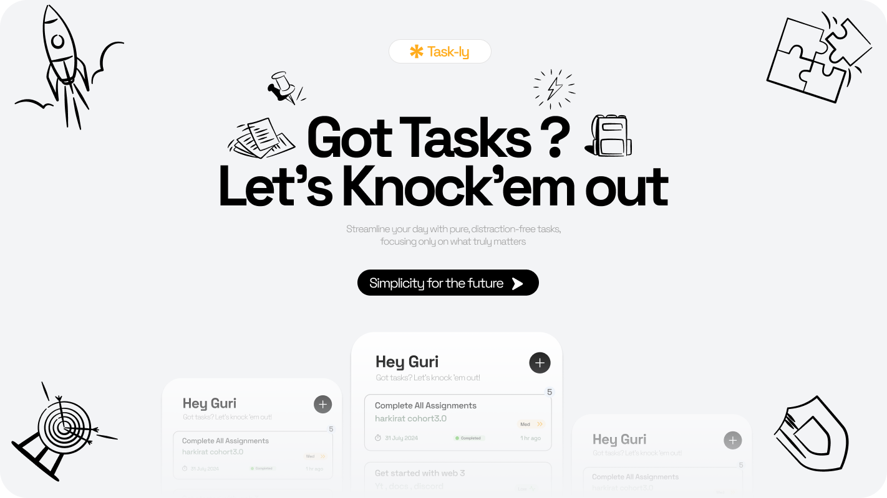

# Task-ly

Task-ly is a productivity application designed to help users manage their tasks efficiently. Currently, the project is in its early stages, featuring a front-end user interface with a hero section. Please note that users cannot sign in yet as the backend functionality is still in development.

 <!-- Replace with the actual path to your image -->

## Features

- **Hero Section**: A visually appealing introduction to the application.
- **Sign In Page**: UI available, but sign-in functionality is not yet implemented.

The backend development is on the roadmap and will be added soon to enhance functionality. Stay tuned for updates!

## Getting Started

To get started with the Task-ly application, clone the repository and install the necessary dependencies.

```bash
git clone https://github.com/Gurvinder-Singh02/Task-ly.git
cd Task-ly
# Add installation commands here
```
