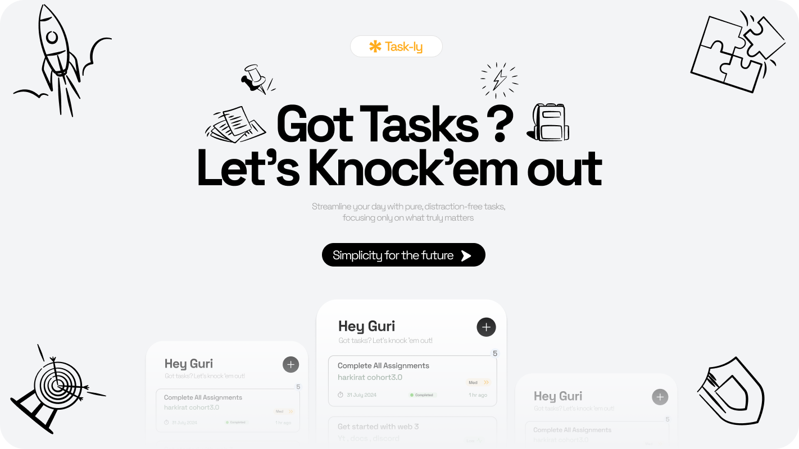
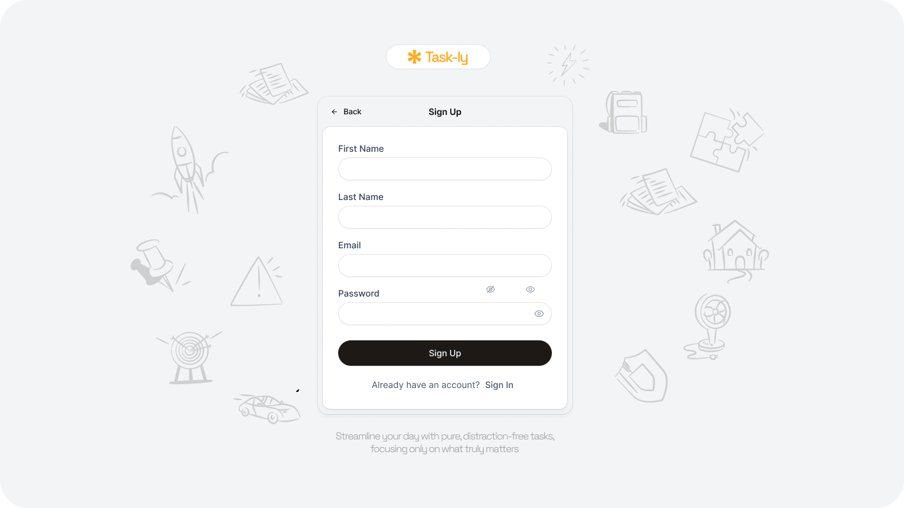
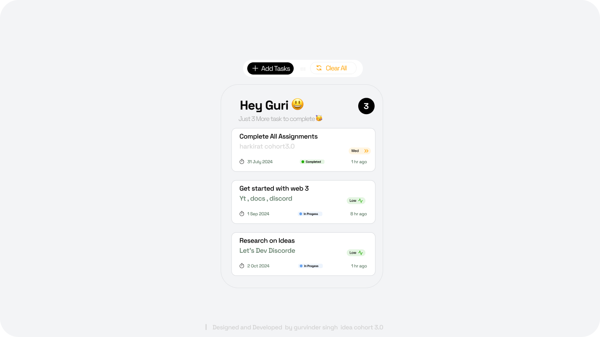

# Taskly

A minimal TODO app built from scratch using HTML, CSS, and JavaScript with Express.js for the backend and JWT for authentication.

 
 
 

## Features

- User registration and authentication using JWT
- Create, read, update, and delete tasks
- Responsive design for various screen sizes

## Technologies Used

- **Frontend:** HTML, CSS, JavaScript
- **Backend:** Node.js, Express.js
- **Database:** In-memory storage (can be replaced with a database like MongoDB)
- **Authentication:** JSON Web Tokens (JWT)

---

Enjoy using Taskly! Happy task management!


<!-- Replace with the actual path to your image -->

## Features

- **Hero Section**: A visually appealing introduction to the application.
- **Sign In Page**: UI available, but sign-in functionality is not yet implemented.

The backend development is on the roadmap and will be added soon to enhance functionality. Stay tuned for updates!

## Getting Started

To get started with the Task-ly application, clone the repository and install the necessary dependencies.

```bash
git clone https://github.com/Gurvinder-Singh02/Task-ly.git
cd Task-ly
# Add installation commands here
```
